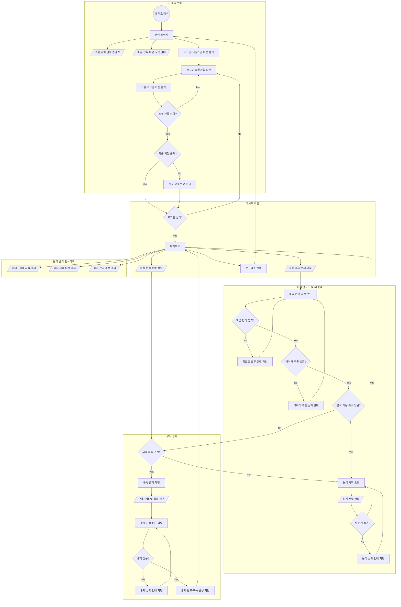

# Finsight User Flow

> 출처: Manyfast 프로젝트 `472e20e8-ec37-444b-a58a-d10f89194f7d`의 유저플로우 "새 플로우 1"
> (버전 1). 배경/목표는 [prd.md](./prd.md), 화면별 상세 동작은
> [feature-spec.md](./feature-spec.md) 참고.
>
> 범례: `((...))` 시작점, `[...]` 화면(page), `[/.../]` 데이터/상태(data), `[...]` 사용자
> 행동(action, 화면과 동일 도형 사용), `{...}` 분기(branch). 각 분기 화살표의 Yes/No는
> 원본 플로우의 positive/negative 조건을 나타낸다.

## 구간별 설명

### 1. 진입 및 인증
비로그인 방문자가 랜딩 페이지에서 핵심 가치와 이용 정책을 확인한 뒤, 로그인·회원가입
버튼으로 인증 화면에 진입한다. 소셜 로그인 인증에 실패하면 로그인 화면에 머물고,
성공하면 기존 계정 여부를 확인해 신규 계정 생성 또는 기존 계정 로그인으로 분기한다.
→ 상세: [F-MVOOAK](./feature-spec.md#f-mvooak-핵심-가치-및-분석-결과-안내),
[F-ENLUHX](./feature-spec.md#f-enluhx-지원-파일-형식-및-이용-정책-안내),
[F-MAFWCW](./feature-spec.md#f-mafwcw-로그인-및-회원가입-전환-경로),
[F-IZGIPZ](./feature-spec.md#f-izgipz-소셜-로그인-및-계정-생성)

### 2. 대시보드 홈
로그인 상태가 확인되지 않으면 로그인 화면으로 되돌아간다. 로그인된 사용자는
대시보드에서 분석 이용 현황(무료 잔여 횟수/구독 상태)과 기존 분석 결과 존재 여부를
확인한다. 로그아웃을 선택하면 랜딩 페이지로 이동한다.
→ 상세: [F-RIRRKL](./feature-spec.md#f-rirrkl-로그인-상태-보호-및-안전한-로그아웃),
[F-PAOWJD](./feature-spec.md#f-paowjd-계정별-분석-이용-현황-및-구독-상태-조회),
[F-PAUYQW](./feature-spec.md#f-pauyqw-대시보드-업로드-및-초기-상태)

### 3. 파일 업로드 및 AI 분석
사용자가 파일을 업로드하면 형식 검증 → 데이터 추출 → 분석 가능 횟수 확인 → AI 분석
순으로 진행된다. 각 단계 실패는 해당 단계로 되돌아가는 재시도 루프를 가진다:
- 형식 무효 → 업로드 오류 안내 → 재업로드
- 데이터 추출 실패 → 추출 실패 안내 → 재업로드
- 분석 가능 횟수 없음 → 구독 결제 플로우(섹션 5)로 분기
- AI 분석 실패 → 분석 실패 안내 → 분석 재시작

분석이 성공하면 대시보드로 돌아가 결과를 표시한다.
→ 상세: [F-ILFWKT](./feature-spec.md#f-ilfwkt-카드-내역서-파일-업로드-및-형식-검증),
[F-KCOAUD](./feature-spec.md#f-kcoaud-ai-분석-실행-및-결과-생성-관리),
[F-ILHNGA](./feature-spec.md#f-ilhnga-무료-분석-이용-횟수-관리)

### 4. 분석 결과 인사이트
대시보드 한 화면에서 카테고리별 지출 결과, 이상 지출 탐지 결과, 절약·관리 추천 결과를
동시에 확인한다. 세 항목은 서로 구분되어 표시된다.
→ 상세: [F-ANJCJR](./feature-spec.md#f-anjcjr-분석-진행-상태-및-통합-인사이트-결과),
[F-VZZTMF](./feature-spec.md#f-vzztmf-카테고리별-지출-현황-분석),
[F-LRPAYO](./feature-spec.md#f-lrpayo-평소와-다른-이상-지출-탐지),
[F-BLDQBC](./feature-spec.md#f-bldqbc-실행-가능한-절약·관리-추천-생성)

### 5. 구독 결제
무료 횟수가 소진된 사용자만 구독 결제 화면으로 진입한다(소진되지 않았다면 바로 분석
시작으로 복귀). 구독 상품/결제 정보를 확인하고 결제를 진행하며, 결제 실패 시 재시도
루프를 거친다. 결제가 완료되면 구독이 활성화되고 대시보드로 복귀해 추가 분석을 이용할
수 있다.
→ 상세: [F-RPFVZX](./feature-spec.md#f-rpfvzx-분석-이용-현황-및-결제-전환-안내),
[F-UXSBGF](./feature-spec.md#f-uxsbgf-월간-구독-결제-진행),
[F-QVPIEG](./feature-spec.md#f-qvpieg-구독-상태-기반-추가-분석-권한-부여)

## 참고

- 이 플로우는 Manyfast 프로젝트 원본을 그대로 옮긴 것이며, 아직 어떤 Feature와도
  명시적으로 연결(reference)되어 있지 않다(`referencedFeatureCount: 0`). 위 "구간별 설명"의
  기능 링크는 이 문서 작성 시점에 PRD/기능 명세서 내용을 기준으로 수동 매핑한 것이므로,
  Manyfast 원본에서 플로우-기능 연결이 추가되면 이 문서도 함께 갱신할 것.
- 결제 관련 두 개의 미확정 정책(구독자 추가 분석 한도, 구독 갱신/해지)은
  [prd.md의 Open Product Decisions](./prd.md#open-product-decisions-구현-전-확정-필요)에서
  추적한다. 확정 전까지는 이 플로우의 섹션 5(구독 결제) 이후 동작(예: 결제 완료 후 매번
  무제한 분석 가능 여부)이 확정되지 않은 상태로 간주할 것.
